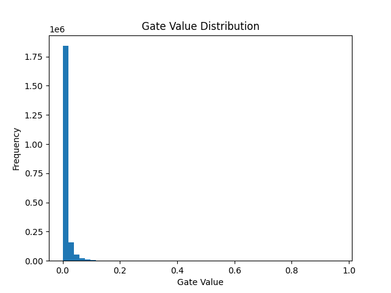

# 🚀 Self-Pruning Neural Network (Learnable Gates)

A PyTorch implementation of a **self-pruning neural network** that dynamically removes unnecessary weights during training using **learnable gates and L1 regularization**.

---

## 📌 Highlights

- Achieved **72.37% accuracy with 76.96% sparsity**
- Model learns to **prune itself during training**
- Demonstrates strong **accuracy vs compression trade-off**
- Built using a **custom neural network layer**

---

## 🧠 Key Idea

Traditional pruning is done **after training**.

In this project:

- Each weight has a **learnable gate parameter**
- Gate values are passed through a **sigmoid function**
- Final weight = `weight × gate`

👉 This allows the network to:
- Keep important connections (gate ≈ 1)
- Remove unnecessary ones (gate ≈ 0)

---

## ⚙️ Architecture

- CNN for feature extraction  
- Prunable fully connected layers  
Input (CIFAR-10 Image)
↓
Conv2D + ReLU + Pooling
↓
Conv2D + ReLU + Pooling
↓
Flatten
↓
PrunableLinear (Gated)
↓
PrunableLinear (Gated)
↓
Output (10 Classes)

---

## 🧮 Loss Function
Total Loss = CrossEntropy + λ × Sparsity Loss

- CrossEntropy → classification accuracy  
- Sparsity Loss → L1 norm of gate values  

---

## 📊 Results

| Lambda | Accuracy (%) | Sparsity (%) |
|--------|-------------|--------------|
| 1e-5   | 72.42       | 52.64        |
| 5e-5   | 72.53       | 69.44        |
| 1e-4   | 72.37       | 76.96        |

---

## 📈 Observations

- Increasing λ increases sparsity significantly  
- Accuracy remains stable up to moderate pruning  
- High sparsity (≈77%) achieved with minimal accuracy drop  

👉 **Best trade-off: λ = 1e-4**

---

## 📉 Gate Distribution (Graph)

The model learns a **bimodal distribution**:

- Values near **0 → pruned weights**
- Values near **1 → important weights**

---

## 🚀 Features

- Custom `PrunableLinear` layer  
- CNN-based architecture (better accuracy)  
- Dynamic pruning during training  
- Best model saving (`.pth`)  
- Results tracking (`results.csv`)  
- Gate visualization  

---

## 🛠️ Tech Stack

- Python  
- PyTorch  
- NumPy  
- Matplotlib  
- tqdm  

---

## 📦 Project Structure
self_pruning_nn/
│
├── models/
│ ├── prunable_linear.py
│ └── network.py
│
├── utils/
│ ├── loss.py
│ ├── metrics.py
│ └── plot.py
│
├── train.py
├── config.py
├── requirements.txt
├── report.md
├── results.csv
└── README.md

---

## ⚙️ Setup & Run

### 1️⃣ Install dependencies
pip install -r requirements.txt

### 2️⃣ Train the model
python train.py

---

## 📁 Outputs

- `results.csv` → accuracy & sparsity comparison  
- `best_model_lambda_*.pth` → trained models  
- `gate_distribution.png` → gate value graph  

---

## 🎯 Conclusion

This project demonstrates that:

- Neural networks can **learn sparsity during training**
- L1 regularization effectively removes redundant weights  
- Highly compressed models can be achieved **without post-processing pruning**

---

## 🔮 Future Work

- Structured pruning (filters/channels)  
- Pruning convolutional layers  
- Combining with quantization  

---

## 👤 Author

**Disha Malik**  
Computer Engineering Student  

---

## ⭐ If you found this useful

Give it a star ⭐